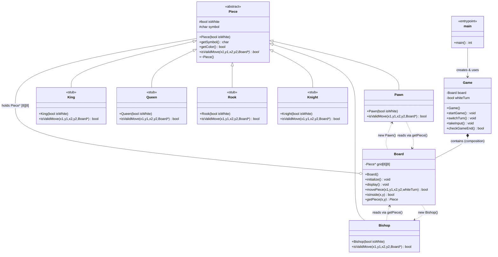

# Chess Game — File Structure & UML Diagram

## 📁 Complete File Structure

```
Chess Game/
├── main.cpp                  # Entry point — creates Game, runs game loop
│
├── Game.h / Game.cpp         # Game controller (turn management, input)
├── Board.h / Board.cpp       # 8×8 grid, piece placement, move execution
│
├── Piece.h / Piece.cpp       # Abstract base class for all pieces
│
├── Pawn.h / Pawn.cpp         # ✅ Implemented — forward move, 2-step, diagonal capture
├── Bishop.h / Bishop.cpp     # ✅ Implemented — diagonal movement, path blocking
│
├── Knight.h / Knight.cpp     # ⚠️ Stub only (entire file commented out)
├── Rook.h / Rook.cpp         # ⚠️ Stub only (entire file commented out)
├── Queen.h / Queen.cpp       # ⚠️ Stub only (entire file commented out)
└── King.h / King.cpp         # ⚠️ Stub only (entire file commented out)
```

> [!NOTE]
> Knight, Rook, Queen, and King files exist but all their code is commented out — they are placeholders not yet implemented.

---

## 🗂️ UML Class Diagram



---

## 🔗 Include / Dependency Map

| File | Includes |
|---|---|
| `main.cpp` | `Game.h` |
| `Game.h` | `Board.h` |
| `Game.cpp` | `Game.h` |
| `Board.h` | `Piece.h` |
| `Board.cpp` | `Board.h`, `Pawn.h`, `Bishop.h` |
| `Piece.h` | _(forward declares `Board`)_ |
| `Pawn.h` | `Piece.h` _(forward declares `Board`)_ |
| `Pawn.cpp` | `Pawn.h`, `Board.h` |
| `Bishop.h` | `Piece.h` |
| `Bishop.cpp` | `Bishop.h`, `Board.h` |
| `Knight/Rook/Queen/King` | _(all commented out — no active includes)_ |

---

## 📌 Key Design Notes

| Aspect | Detail |
|---|---|
| **Polymorphism** | `Piece::isValidMove()` is pure virtual — each piece overrides it |
| **Composition** | `Game` owns `Board` by value (not pointer) |
| **Aggregation** | `Board` holds raw `Piece*` pointers in a 2D grid |
| **Memory Management** | `Board::movePiece()` calls `delete` on captured pieces |
| **Forward Declaration** | `Piece.h` and `Pawn.h` forward-declare `Board` to avoid circular includes |
| **Coordinate System** | User inputs 1-based (x=col, y=row); converted to 0-based `grid[row][col]` in `Game::takeInput()` |
| **Stub Status** | Knight, Rook, Queen, King exist as files but are entirely commented out |
